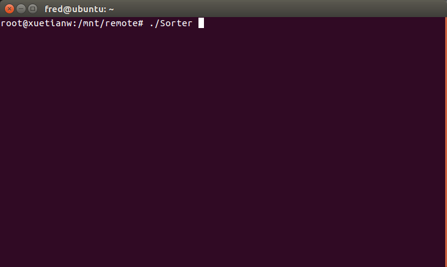
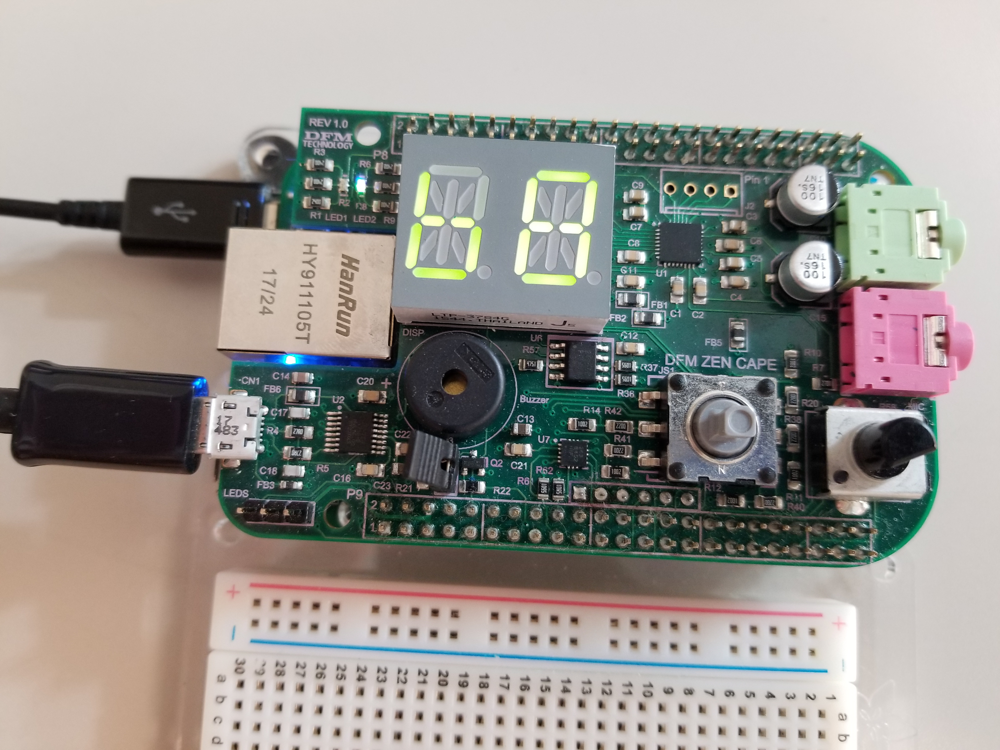
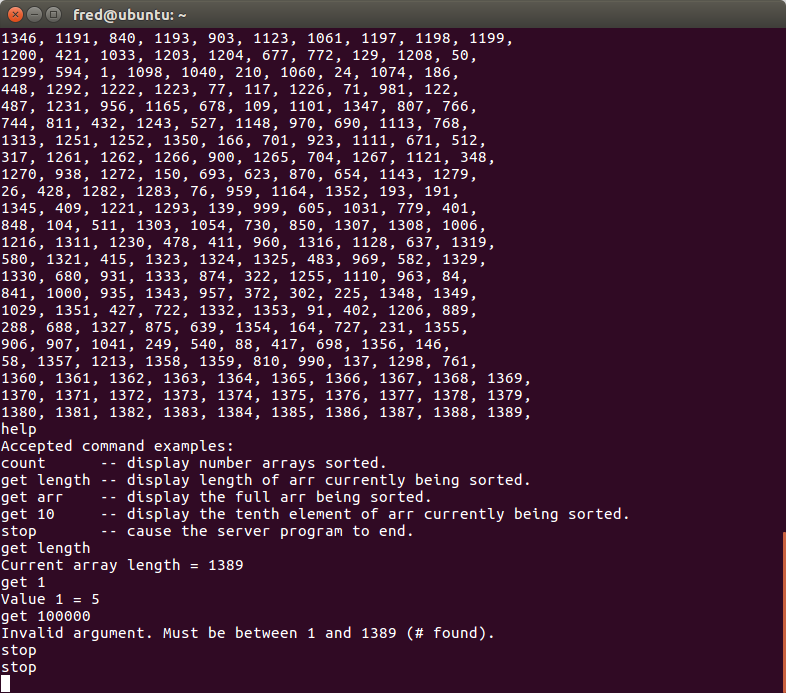

# Embedded Sorting Programming

runs Sorter on the target to sort arrays of integers
and listen to a UDP socket. 
 
on the targer run Sorter

use the Zen cape's potentiometer to allow the user to select the size of array to sort.

Zen cape’s 2-character (14-segment display) to display the number of arrays sorted per second.
 

user connect to the socket netcat -u 192.168.7.2

**full demo video can be watched at**
https://photos.app.goo.gl/iyx7XJiNbcSnFLDSA

or **Youtube** https://www.youtube.com/watch?v=4K8ymeFKTLY&t=8s